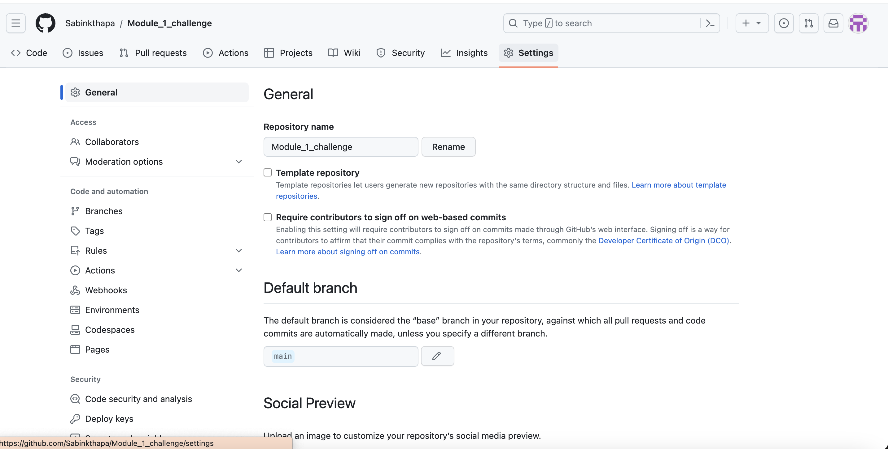
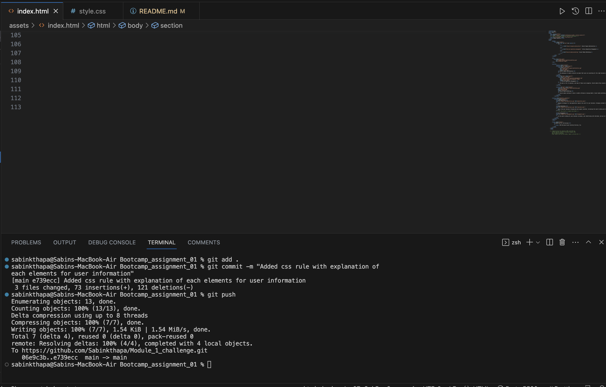

# <Semantics html ,css portfolio>

## This project helps the users to understand how to organise semantic structure of the HTML in web development along with how we can increase the efficiency of the css by consolidating the selectors and properites with the given starter code. As a hired person by marketing agency with the given refactoring (existing code), my responsibilites is to make improve the code without changing the function for better accessibility standards and search engine optimization.

- Motivation :
My motivation for this project is to make user understand how we can improve the quality of the code as well as information on github command and deployment of our websites in github.

- Reason for this project :
To help users understand how it looks for the semantic html elements with logical structure along with accesible alt attributes and css properties

- Problem this project solved 
This project provides the guidance for basic semantics structure for HTML and css properties  along with how to create the repository in github and command line to push out local files and directories to github.

## Usage

Apart from understanding the basic structure of HTML and CSS properties, user will understand the significance of inspecting the html and css code for better understanding and debugging of code. Also, github is powerful tool to make a static repository for our websites. The screenshot below with github_push file shows the direction for push the local file to github with command line to push the local files to git hub repository. Check the other files as well for more information about inspecting ,creating new repositories and command lines for github.

Some of the screenshot will help the user to understand how it can be done:

Some of the command lines for github:

- git init 
(The git init command creates a new Git repository.)
- git status
- Git add . Or (git add -a)  (The git add command adds a change in the working directory to the staging area. It tells Git that you want to include updates to a particular file in the next commit)

- Git commit -m “initial commit” (The "commit" command is used to save your changes to the local repository and sets the commit's message)
- Git branch -M main
- git remote add origin git@github.com:Sabinkthapa/02-challenge.git(http or ssh link in github repository) -(set-upstream and the name of the active branch to push.)
- git push -u origin ( push your local changes to your online repository.)

## Deployment link
-Please check the deployed link of the website.
-https://sabinkthapa.github.io/Semantics_html-css_portfolio/
